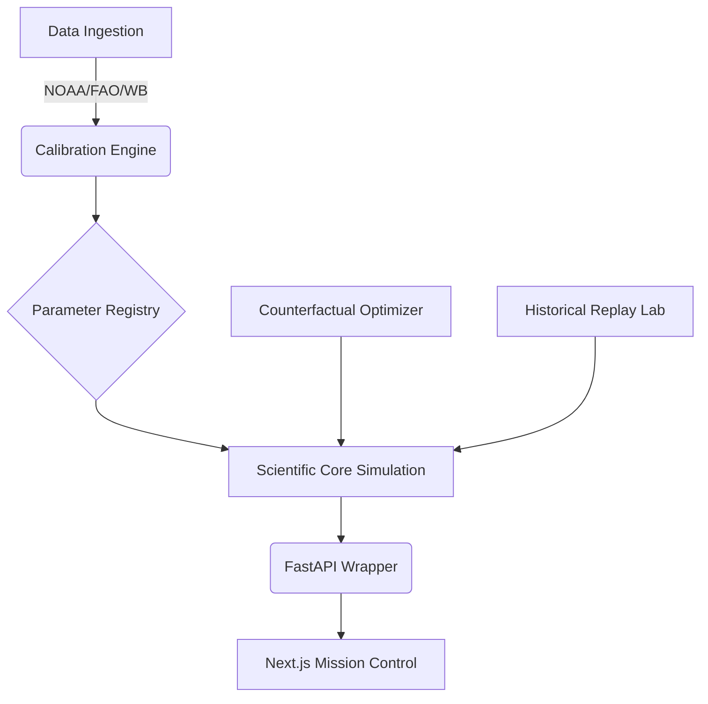

# TerraLattice: Planetary Digital Twin


## Overview
TerraLattice is a research-grade Climate-Economy-Society Digital Twin designed for cascading risk simulation and planetary decision intelligence. By shifting focus from isolated impact models to a holistic causal network, TerraLattice allows researchers to simulate localized climate anomalies (e.g., Drought) and observe their n-order systemic consequences on agriculture, food security, economic indicators, and societal stability.

## Motivation & Research Novelty
Most traditional climate impact models operate in silos. TerraLattice leverages a **Graph-based Causal Ontology** to represent the world. By decoupling the causal structure into distinct, statistically calibrated systems (Climate, Water, Agriculture, Public Health, Economy, Society, Policy), TerraLattice allows for dynamic counterfactual testing—answering critical "What if?" intervention questions to uncover Pareto-optimal policy decisions.

## Architecture



## Scientific Methodology
TerraLattice utilizes a discrete time-stepping simulator (quarterly) using Mean-Reverting Stochastic differential parameters.
Edges are calibrated using **Granger Causality** and **Vector Autoregression (VAR)**.

## Installation & Quick Start

```bash
git clone https://github.com/RonitM2k06/Genealogy_Ai.git terralattice
cd terralattice

# Install Python backend
pip install -r requirements.txt

# Start Backend API
uvicorn api:app --reload

# Start Frontend Mission Control
cd frontend
npm install
npm run dev
```

### Docker
```bash
docker-compose up --build
```

## Documentation
- [Architecture & Implementation Plan](docs/architecture/implementation_plan.md)
- [API Reference](docs/api/api.md)
- [Validation & Calibration](docs/validation/historical_validation.md)
- [Benchmarks](docs/benchmarks/benchmark_report.md)

## Citation
If you use this software in your research, please cite:
```
Mongia, Ronit. (2026). TerraLattice: A Climate-Economy-Society Digital Twin for Cascading Risk Simulation. Amity University.
```

## Acknowledgements
Supported by the open-source climate modeling community.
